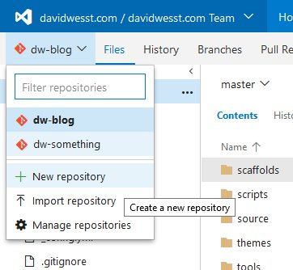
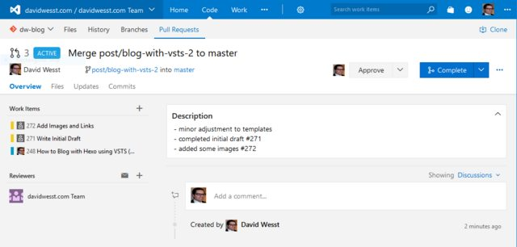

_This is part 2 of 5 of my **How to Blog with VSTS** series. Links to the other parts will be added as they are made available._

+ [Part 1: Setup][1]
+ [Part 2: Code][2] 
+ [Part 3: Work][3]
+ [Part 4: Build][4]
+ Part 5: Release

[1]: https://blog.davidwesst.com/2016/10/How-to-Blog-with-VSTS-Part-1/
[2]: https://blog.davidwesst.com/2016/11/How-to-Blog-with-VSTS-Part-2/
[3]: https://blog.davidwesst.com/2016/11/How-to-Blog-with-VSTS-Part-3/
[4]: https://blog.davidwesst.com/2016/11/How-to-Blog-with-VSTS-Part-4/
[5]: #

---

I've been tinkering with Visual Studio Team Services off and on since its public release, but never did anything really productive with it. Over the past couple of weeks, I finally bit the bullet and decided to move my most prevelant personal project into VSTS: this blog.

In this post we are going to get our blog setup in source control so we can start add posts.

## You Don't Need Your Code in VSTS to Use VSTS
This is important.

VSTS is an all-in-one solution for your software project. Source control is a part of that solution, but it should be noted that _you don't **need** to use VSTS hosted source control_ to use VSTS. I had originally setup my project just to mess with builds, releases, and work items. All my [source code](https://github.com/davidwesst/dw-blog) lived exclusively on GitHub, and VSTS still worked just fine.

The only difference I've found is a few "nice to have" features in the Work tab, which we'll cover [in the next post][3]. Generally speaking, though, there isn't any significant differences or advantages with using VSTS to host your code except for convienience and those few "nice to have" features I mentioned.

### But I Want to Stay Open Source!
VSTS _does not_ provide you with a public view of your source code. This is my major criticism of the _Code_ features, and for VSTS as a whole. 

That being said, if I want people to be able to view my source code (which I do) then GitHub is a much better platform for that purpose. Consider that GitHub is ubiquitous with open source software development, so much so that even Microsoft uses it to share source code. People are more likely to find my code on GitHub than the focused platform that is VSTS. 

Still, the visibility is a project. To solve this just use both. I use the private repositories of VSTS as my working repos where a have a ton of branches and use that for my builds, feature development and so on. When my work is done, I publish my branches to GitHub where people could make pull requests, review my code, and so on.

In a sense I use VSTS for internal development and GitHub for external/public development and feedback.

### But Now My Development Isn't Transparent!
You're right, other than my git history, it's not.

But, as previously mentioned, you don't need to use VSTS to host your source code or your work items (as you'll see in [part 3][3]). You just need to use the parts you want, and use other tools as you see fit. If you only want to use VSTS for the builds and releases and GitHub for source control and issue tracking, then by all means go ahead and do that.

In my case, my blog is a one man show that doesn't really get a lot of people reviewing the source code. I don't need the transparency for a project this small, but I still like keeping code visible and I keep tabs on the GitHub repository by using the [GitHub Stats Widget from Yod Labs](https://marketplace.visualstudio.com/items?itemName=YodLabs.yodlabs-githubstats).

If you're still interested in using the code tab, then keep calm and carry on. If not, you can jump ahead to the [Work][3], [Builds][4], or [Releases][5] posts.

## The "Code" Tab


When you open up your project in VSTS, you'll see the "Code" link in the header. This is where we'll be living for the duration of this post. I am also assuming that did as I did in [part 1][1] and selected Git as the type of source control you want to use for your project.

### The Default Project Repository
When you setup your project, you're given a default project repository with the same name of the project. In my case, I have a repository called _davidwesst.com_.

You could use this to store the source code of your blog, but I tend to use this repository as a project wiki that spans all repositories. When you click on the "Welcome" link on your project home page, you can see a rendered version of the README.md files in each of your repositories. This repository ends up acting as the "root" of all documentation on the project.

If you delete it and go back to the Welcome page you get this message:


Since VSTS has a decicated spot for it anyway, I figure it makes sense to use it for cross-repository documentation. 

### Creating Your Blog Repository
Click on the repository dropdown menu and select _New Repository_. Name it and you're ready to push source code up to VSTS. Just follow the your static site generators instructions to setup your blog, and push the code up.

If you already have your blog published somewhere else like GitHub, you can use the _Import Repository_ feature and clone the source and the history into VSTS.



#### For Those Using Hexo
If you're using Hexo as your static site generator, you can follow [these instructions](https://hexo.io/docs/setup.html) to get setup.

Before you push, make sure you add a `.gitignore` file that excludes the _public_ and _node\_modules_ as those folders contain the generated static content and generator dependencies, which we don't need to store in source control.

## Writing Blog Posts
We will tackle this topic again in [part 3][3] but for now I want to describe the workflow I use to write blog posts. It should be noted that the workflow I'm about to describe works in either VSTS or GitHub. I used it in GitHub for a long time, and it continues to serve me well in VSTS.

Here's a summary of what I do:
1. Create a new branch off of `master`
2. Write the post and commit all files to the new branch
3. Create a Pull Request to pull the post branch into `master`
4. Approve the PR when I'm ready to publish the post

### Post Branches
With a static site, or in this case a static blog, each post is a new file (or files if you're including images). I think of each post as a new feature and use a [_topic branch_](https://git-scm.com/book/en/v2/Git-Branching-Branching-Workflows#Topic-Branches). 

My `master` branch is my most recent and stable code, and so each post is a branch off of `master`. In short, I do the following:

```bash
git checkout -b post/my-new-post
# ...write the post...
git add . --all
git commit -m "wrote new post"
git push -u origin post/my-new-post
```

When I'm done, the branch contains everything I need to publish the post. All I need to do is merge, but I generally don't do that from the command line on my machine. Rather, I use Pull Requests.

### Pull Requests
You may have noticed the Pull Requests link in the header earlier, which is a nice way to merge a post branch without needing a computer with the project setup. In my case, I tend to write my posts in advance and want to publish them on Monday mornings. I don't necessarily want to have to open up a command line and do the merge and push from my workstation.

With Pull Requests, I can do the merge from any web browser, and it forces me to give myself a code review. I look over the spelling and grammar and make sure everything looks good. When I'm done, I click "Complete" and it's merged into my master branch, which is what is used to generate the site content and published to my web host.



## But Wait, There's More!
Absolultely. 

More specifically [Work][3] for managing issue tracking, [Builds][4] for generating the blog content, and [Releases][5] for publishing posts. So stay tuned!
