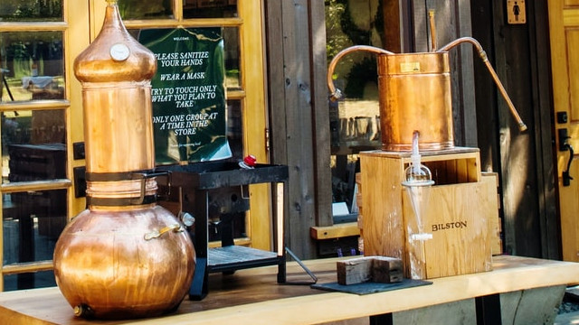

Enabling creativity with technology, one game at a time.

This tagline is something I spent a long time thinking through. I iterated on it, got feedback occasionally, and reflected its meaning against the different things I'm doing today (and plan to do in the future).

The question is: Why is this so important to me?

## A Brief History of me and Sales
Sales was always a part of my early tech jobs. Whether I was working a booth with the sales team, or working with clients to figure how tech (and my company) could fix their business problems. 

In these sales-y situations, being able to distill an idea down to a sentence is important when you might only have 30 seconds to pitch your idea (hence the term "elevator pitch"). 

So, sales is where I got the idea, but why do I stick to it now? 

## The Reflective Process of Idea Distillation

That heading sounds fancy, but it does a good job of summing up how I breakdown ideas and implementation effort to the lower common denominator. Distilling an idea down to a tagline requires that I take the time to deeply understand the idea from as many angles as I (and others I work with) can think of. It's through this reflective process is where I force myself to understand the value the idea and enabling me lazer focus the solutions I come up with along with the priority of the work.

### For Example: Problem-Solution Statements
By day, I'm a Solutions Architect focusing on cloud and ERP tech for higher education. Based on my title, one might think that my job is focused on designing solutions. 

While I do design solutions, a large part of my job is clearly defining the problems before designing solutions. This is a very analytical process that involves a lot talking to folks (both tech and non-tech) and understanding the surrounding work (or problem environment). 

Once I _know for sure_ what I think we need to solve, I create a problem statement that quickly answers the  question "What problem are we trying to fix?". 

That problem statement is just like a tagline for the problem my team is working working. Now, we can start answering the problem statement with _multiple_ solution statements and sharing them with the business team and beyond.

# Communicate All The Things!
Now, with the problem statement in hand (or mind I suppose) I can share it

This is the other value proposition of  a tagline. A quick and consise way to share an idea, which opens doors to everything else. Feedback loops, prioritization of tasks, solution validation, and so on. 

Marketing and sales could be put into that list too, but I try not to focus on that up front as my delusions of grandeur are an easy way to keep me distracted from actually building the thing in the first place. 

# TL;DR; | Conclusion 
In short, taglines are an important tool for me for two reasons: 

1) It forces me to refine and deeply understand the problem or purpose of the work in front of me.
2) It provides me a quick way to communicate the idea to solicit feedback and validate work priority and the solution design. 

Although it seems like it's purely a marketing or sales sort of task, it can definitely prove to help your solution design if you have one for your project.

Thanks for playing. 

~ DW

---

_Photo Credits_

- Title Photo by <a href="https://unsplash.com/@charliefirth?utm_source=unsplash&utm_medium=referral&utm_content=creditCopyText">Charlie Firth</a> on <a href="https://unsplash.com/s/photos/catch-phrase?utm_source=unsplash&utm_medium=referral&utm_content=creditCopyText">Unsplash</a>
- Photo by <a href="https://unsplash.com/@victoriabcphotographer?utm_source=unsplash&utm_medium=referral&utm_content=creditCopyText">Christina Victoria Craft</a> on <a href="https://unsplash.com/s/photos/distill?utm_source=unsplash&utm_medium=referral&utm_content=creditCopyText">Unsplash</a>
  
  

